# **Setting Up a Discord Server**

## Overview
Discord provides a flexible communication platform, letting users customize their communication spaces. It enables the creation of servers, channels, and categories for organized interaction. This versatility makes Discord a leading choice among digital communication platforms. #Explain channels and categories

!!! Warning

    Please ensure that your Discord application is open and that you are logged in into your Discord account before continuing with this guide.

## Creating a server

**1.** Click the "Add a Server" button, represented by a plus sign (+) icon on the left-hand side of the Discord's Home interface. 
<figure markdown="span">
  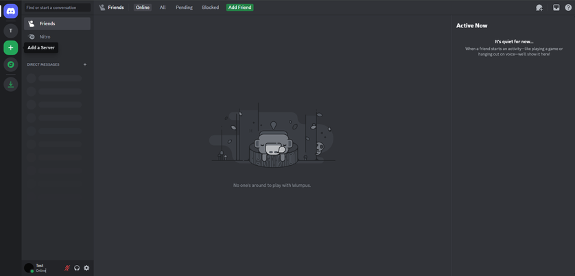{ width="650" }
</figure> 

**2.** Click your desired server type. For a custom server, choose "Create My Own".
<figure markdown="span">
  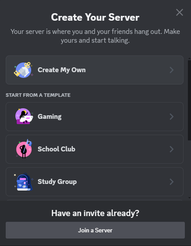{ width="350" }
</figure>

**3.** Choose and click who the server is for. To bypass this step, click "Skip this question for now".
<figure markdown="span">
  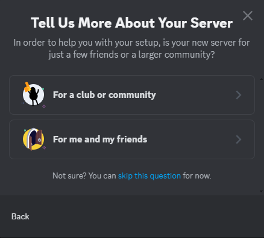{ width="350" }
</figure>

**4.** Give your server a name and click the "Create" button.

??? Tip "Use a descriptive name"

    Choose a name that reflects the purpose of your server. This helps people find and identify with your community.

<figure markdown="span">
  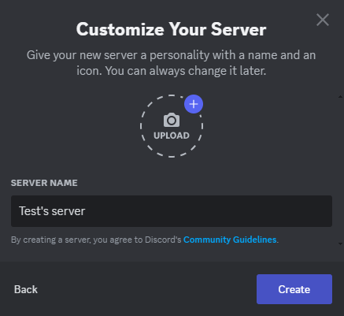{ width="350" }
</figure>

!!! Warning

    Please ensure that you are currently in your created server before proceeding to creating categories and channels.

    
## Creating a category in your server

**1.** Right click on the empty space of your channel list or click the dropdown menu next to your server's name.
<figure markdown="span">
  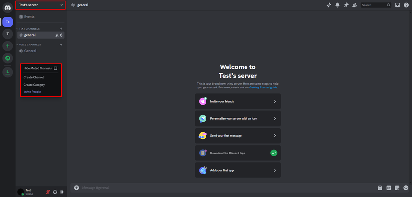{ width="650" }
</figure>

**2.** Click the **"Create Category"** option.
<figure markdown="span">
  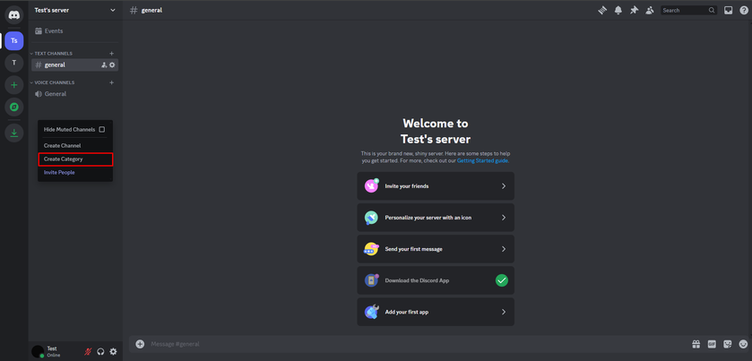{ width="650" }
</figure>

**3.** Give your category a descriptive name.

??? Info "Private category"

    If you wish to privatized your category, just click the "Private Category" button.
    <figure markdown="span">
        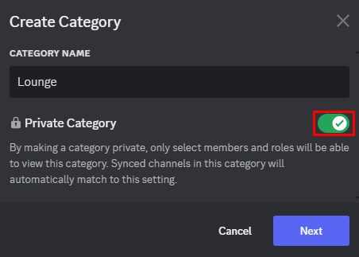{ width="350" }
    </figure>

<figure markdown="span">
  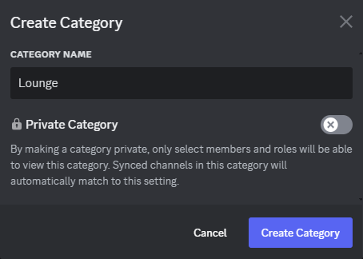{ width="350" }
</figure>

**4.** Click the **"Create Category"** button to finish creating your category.
!!! Note "A moment of patience"
    If your newly created category doesn't appear immediately, please allow a few seconds for the update to process.
<figure markdown="span">
  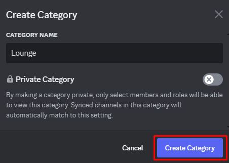{ width="350" }
</figure>
<!-- **Success!**  You've successfully created a new category in your Discord server. Now, you can start adding channels within it! -->

## Creating a channel in your server

**1.** Right click on the empty space of your channel list or click the dropdown menu next to your server's name.  
<figure markdown="span">
  { width="650" }
</figure>

**2.** Click the **"Create Channel"** option.
<figure markdown="span">
  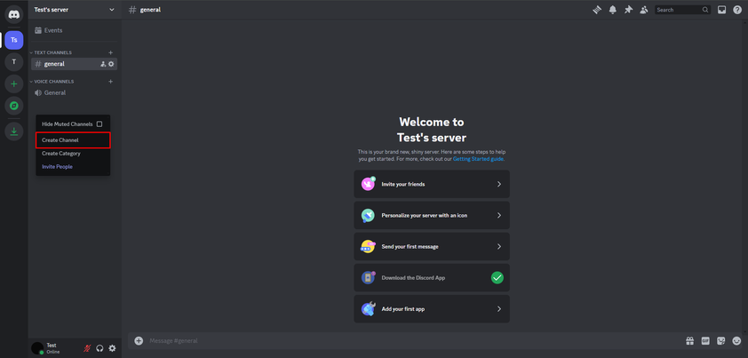{ width="650" }
</figure>

**3.** Click the type of channel you want to make, either **Text** or **Voice** channel.

??? Info "Private channel"

    **1.** If you wish to privatized your channel, just click the **"Private Channel"** button.  
    <figure markdown="span">
        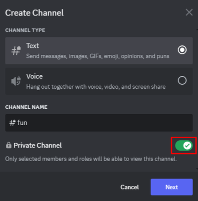{ width="350" }
    </figure> 
    **2.** Once you proceed to create the channel, you can customize who can access the private channel.
    <figure markdown="span">
        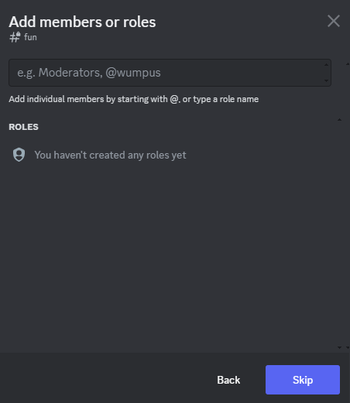{ width="350" }
    </figure> 

<figure markdown="span">
  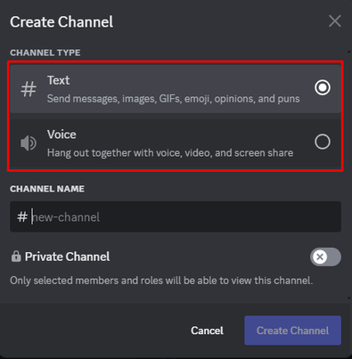{ width="350" }
</figure> 

**4.** Give your text channel a descriptive name and click the "Create Channel" button.

!!! Note "A moment of patience"
    If your newly created channel doesn't appear immediately, please allow a few seconds for the update to process.
<figure markdown="span">
  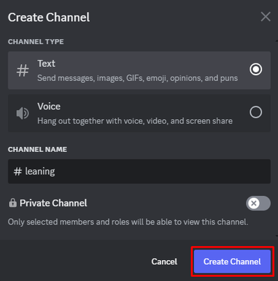{ width="350" }
</figure> 
<!-- **Success!**  You've created a new text channel. Start chatting and sharing content! -->

## Conclusion

By the end of this section, you will have successfully learned the following:

✅ How to create a new Discord server  
✅ How to create a category in your server  
✅ How to create a channel in your server

**Great job 🤗! You're ready to customize your server further and start building your Discord community.**