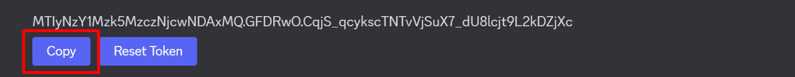

# **Setting Up a Server Bot: Creation and Integration**

## Overview
Discord bots are cool helpers that make your chat server more fun and keep things in order. They can tell jokes, run games, or make sure people follow the rules.This section helps you understand Discord bot accounts and guides you through the creation and integration process.

??? Question "What is a Discord bot account and what can you do with it?"

    Think of a Discord bot as a helpful automated program on your server. You'll need a dedicated Discord bot account separate from your user account to control and manage these custom bots.

    - **Manage Your Bot:** Configure its settings, commands, and presence on your server.
    - **Run Pre-Built Bots:** Add and customize many existing bots from online repositories, covering moderation, fun games, and more.
    - **Connect to Self-Coded Bots:** Link the bot account to advanced custom bots you've developed yourself (this does require programming knowledge).

!!! Note
    This guide doesn't cover building or coding the bot's functionality. That's a separate, more technical process often involving programming knowledge.

## Creating Bot Account

**1.** Navigate to the [**Discord Developer Portal website**](https://discord.com/developers/applications){: style="color: #7289DA;"}   

**2.** Enter your login credentials and then click the **"Log In"** button.

<figure markdown="span">
  { width="800" }
</figure>

???+ Note "Are you human?"
    If the **Are you human?** prompt appears, click **"Confirm"**. You may also need to check your email to verify your login.

**3.** Click the **"New Application"** button in your screen's top-right corner.

<figure markdown="span">
  { width="800" }
</figure>

**4.** Give your bot a creative and descriptive name, then click the **"Create"** button.

<figure markdown="span">
  { width="400" }
</figure>

??? Tip "Use a descriptive name"
    Choose a name that helps users understand what your bot does or represents. This will make it stand out and easy to find on Discord.
???+ Note
    Agree to the Developer Terms and Policy by clicking the checkbox if prompted to.

**5.** Select the **Bot** tab in the left navigation menu.

<figure markdown="span">
  { width="275" }
</figure>

**6.** Customize your bot's functionality by adjusting its settings, permissions, and commands.

??? Info "Public bot"

    To allow others to invite your bot, ensure the **Public Bot** option is checked.

**7.** When finished, click the **"Save Changes"** Button

<figure markdown="span">
  { width=800" }
</figure>

**8.** Click the **"Reset Token"** button and then click the **"Copy"** button to copy your token.

<figure markdown="span">
  { width="800" }
</figure>
!!! Info "Token visibility"
    For security reasons, your token is only visible upon hitting the **"Reset Token"** button.
!!! Warning "Protect your bot token!"
    - **Never share your token!** It's like your bot's password.
    - **Token Leaked?** Click **"Reset Token"**  immediately to create a new, secure token.
    - **Update Your Code:** Ensure your bot uses the new token to function correctly.

Congratulations! 🎉 You've created a bot account. You can now log in using your token." 

## How to Add Your Bot to Your Discord Server

<!-- Adding a bot lets its code run on your Discord server. First, you'll invite the bot to your server. Then, you'll grant it specific permissions – these control what the bot can do, such as reading messages, sending messages, or managing roles. Once added, the bot will become active and be able to interact with your server members. -->

**1.** Ensure you're logged in to [**Discord Developer Portal website**](https://discord.com/developers/applications){: style="color: #7289DA;"}  with the account you used to create your bot.  

**2.** Navigate to the applications page. Then, under **My Applications**, select your desired application.  

<figure markdown="span">
  { width="800" }
</figure>

**3.** Click the **OAuth2** tab in the left side navigation panel.  

<figure markdown="span">
  { width="250" }
</figure>

**4.** Find the **Scopes** section and check the box next to **bot**.  

<figure markdown="span">
  { width="800" }
</figure>

**5.** Within the **Bot Permissions** section, select the permissions you want your bot to have.

<figure markdown="span">
  { width="800" }
</figure>

<!-- **Note:** Your changes will be saved automatically. -->

**6.** Copy the URL, paste it into your browser, and go to the page. You'll see a list of servers; choose the one you want and click **"Authorize"**.

<figure markdown="span">
  { width="300" }
</figure>

Congratulations! 🎉 Your bot is now on the server. 🤖 Get ready to see it in action!

## Conclusion

By the end of this section, you will have successfully learned the following:

✅ You now grasp what Discord bot accounts are and how they offer exciting ways to interact with your community.  
✅ You've successfully navigated the Developer Portal and created your bot account.  
✅ You've learned how to invite your bot to a server and grant it the necessary permissions for its functions.

**Great job 🤗! Your bot is up and running on Discord!**

