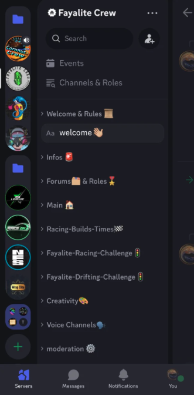
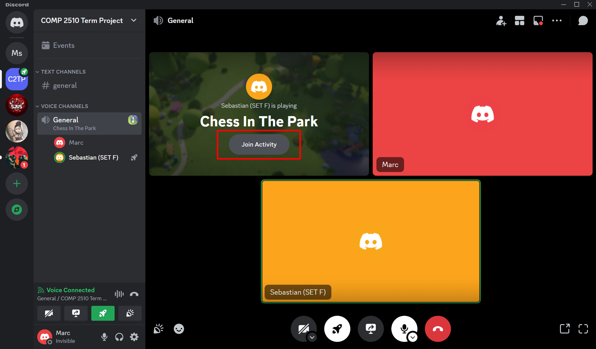
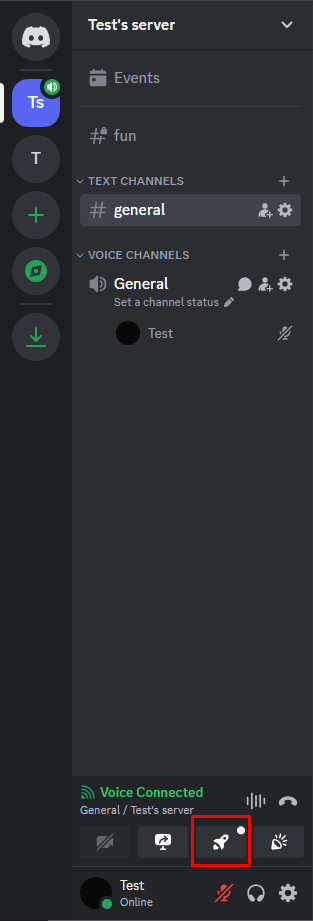
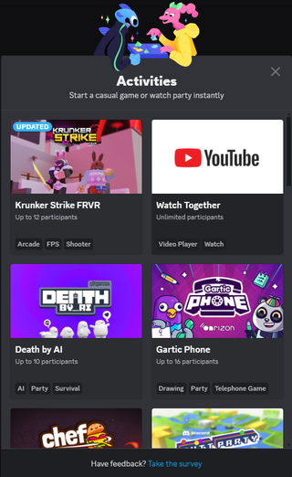
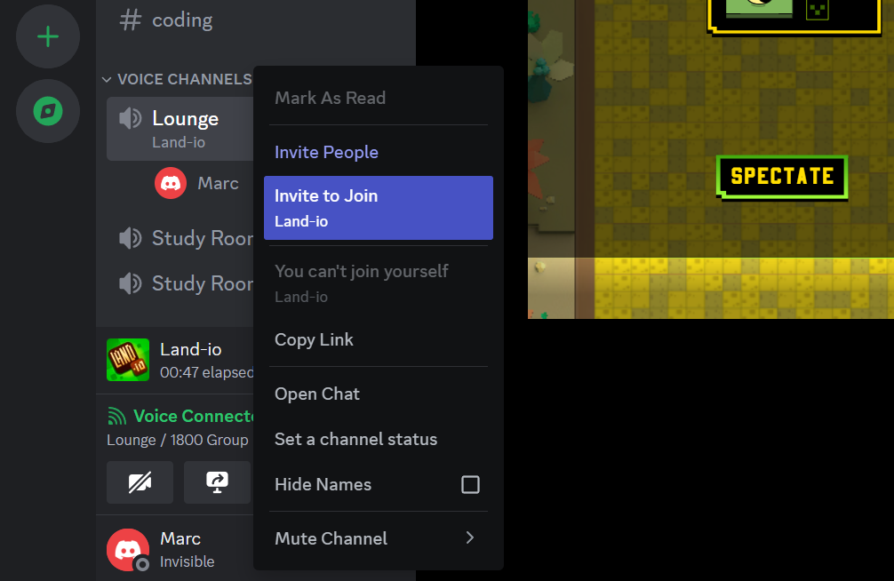

# **Launching and Joining Discord Activities**

## Overview

This section will cover the basics of starting and participating in Discord activities. Get ready to transform your voice channels into hubs of fun! We'll walk you through finding excellent activities, launching them, and inviting your friends to join.

!!! warning "Prerequisites"

    Ensure you are logged in to your Discord account and have a server available to join or start an activity.    Access may be restricted otherwise.

## How to Join a Discord Activity

**1.** Click on the server icon, located on the left side of your screen, where you'd like to join an activity.

<figure markdown="span">
  { width="400" }
</figure>

**2.** Click on a voice channel where someone launched an activity.

**3.** Click the **"Join Activity"** button in the activity window.
<figure markdown="span">
  { width="900" }
</figure>

???+ Note "Missing rocket ship icon"

    - Not all servers support Discord Activities. If you don't see the rocket ship icon in a voice channel, it's likely Activities aren't enabled for that server.
    - Contact a server moderator or admin to check if they're allowed and resolve potential permission issues.

Congratulations! 🎉 You've joined an Activity! 

## How to Start a Discord Activity

**1.** Click on the server icon, located on the left side of your screen, where you'd like to join an activity.
<figure markdown="span">
  { width="400" }
</figure>

**2.** Click on a voice channel.

**3.** Click the rocket ship icon near the bottom of your screen.
<figure markdown="span">
  { width="400" }
</figure>

**4.** Click the game or activity you want to launch.
<figure markdown="span">
  { width="400" }
</figure>

??? Question "How to get people to play with?"
    - **Option 1:** Right-click on the name of your voice channel and choose **Invite to Join**.
    <figure markdown="span">
        { width="900" }
    </figure>
    - **Option 2:** Discord will generate a unique link. Click to copy it, then paste that link to a chat to tell your friends.
    - **Option 3:** Anyone on the server who can see your activity can click **Join Activity** if they want to play!

Congratulations! 🎉 You've successfully started an Activity!

## Conclusion

By the end of this section, you will have successfully learned the following:

✅ How to find and join awesome Discord Activities.  
✅ How to launch your activity and invite friends.

**Great job 🤗! You're ready to add some serious fun to your voice chats!**
